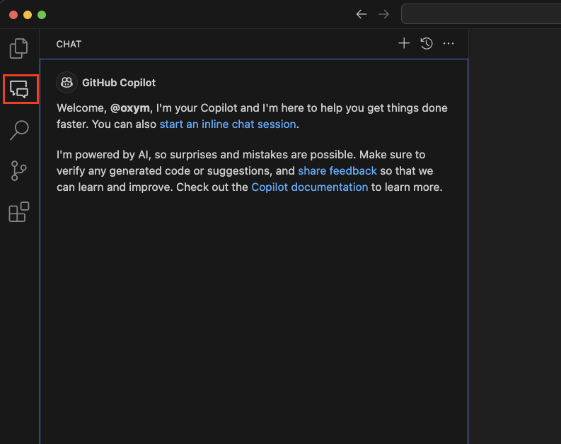
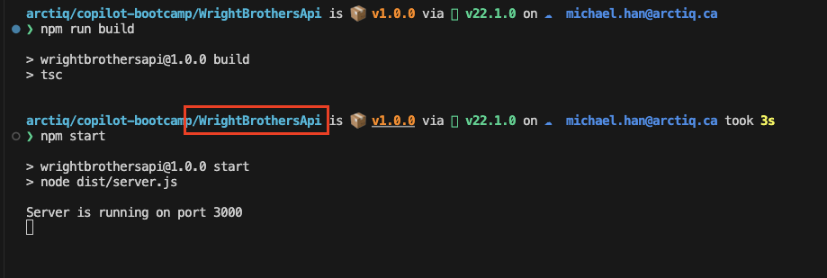

# Lab 1.1 - Pre-Flight Checklist: Setting Up GitHub Copilot and your repository

Compare this to "Preparing Your Travel Itinerary, Checking Passport, Printing Boarding Pass". Just as travelers plan their journey, participants will set up their GitHub repository, planning their coding journey. In this Hands-On Lab, you will learn how to navigate GitHub, create a new issue and obtain your own GitHub repo with the code for these hands-on labs. You will be working on your own repo in the following labs.

## Estimated time to complete

- 10 min

## Objectives

- Set up your development environemnt, and configure your local clone of the repository.
    - Step 1: Set up your development environment
    - Step 2: Verify Copilot Functionality
    - Step 3: Verify the application runs
    - Step 4: Verify calling the REST API

You can now use the development environment to work on the exercises in the Hands on Labs. 🔨

### Step 1: Set up your development environment

#### Install development tools

- Install [Git](https://git-scm.com/downloads)
- Install [Visual Studio Code](https://code.visualstudio.com/download)
- Open Visual Studio Code. Go to the Extensions view (View -> Extensions), searching for “GitHub Copilot”, “GitHub Copilot Chat” and "REST Client", and clicking the Install button for each

#### Install Node.js

- Node.js is the runtime that allows you to run JavaScript on your server. npm (Node Package Manager) is included with Node.js and allows you to install and manage Node.js packages. The latest LTS Node.js (including npm) can be downloaded from [here](https://nodejs.org/en/download)

#### Clone the repository

- Run the following command in the terminal to clone the repository:

    ```sh
    git clone https://github.com/ArctiqTeam/copilot-bootcamp.git
    ```

### Step 2: Verify Copilot Functionality

#### Hello to Copilot

- Click on the Copilot icon on the left side of the screen to open the chat.



- Type `Hello` and press `Enter` to interact with Copilot.

## Optional Verification Steps

### Step 3: Verify the application runs

#### Run application

- Startup the application and verify the application is running.
- From the terminal window, navigate to the application folder: `cd ./WrightBrothersApi`
- Install the application dependencies by typing the following command in the terminal:
    
    ```sh
    npm install
    ```

- Run the application by typing the following commands in the terminal:

    ```sh
    npm run build
    npm start
    ```

> [!NOTE]
> If you encounter an error message like `Could not read package.json`, it's likely that you're executing the command from an incorrect directory. To resolve this, navigate to the correct directory using the command `cd ./WrightBrothersApi`. If you need to move one level up in the directory structure, use the command `cd ..`. The corrcect directory is the one that contains the `package.json` file.



### Step 4: Verify calling the REST API

#### Rest Client Extension

The REST API client extension is very useful to quickly execute HTTP requests in your IDE and have all HTTP requests in source control.

- Open the `Examples/Flights.http` file, click `Send Request` to execute the `takeFlight` request.

    ```
        Send Request
    POST http://localhost:3000/flights/1/takeFlight/75 HTTP/1.1
    content-type: application/json
    ```

- You will see that the flight is taking off and the response is `200 OK`.

- Response will be:

    ```md
    HTTP/1.1 200 OK

    ...
    
    Connection: close

    Flight took off and flew 75 kilometers/miles.
    ```

- Stop the application by pressing `Ctrl+C` in the terminal window.

#### Verify the unit tests

- Run existing unit tests in the `Tests` folder by typing the following command in the terminal:

    ```sh
    npm test
    ```

- The tests should run and pass.

    ```sh
    Test Suites: 1 passed, 1 total
    Tests:       1 passed, 1 total
    Snapshots:   0 total
    Time:        0.546 s
    ```

### Congratulations you've made it to the end! &#9992;

#### And with that, you've now concluded this module. We hope you enjoyed it! &#x1F60A;
