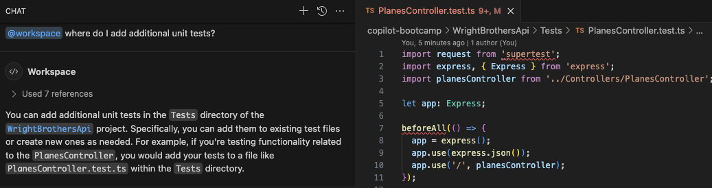
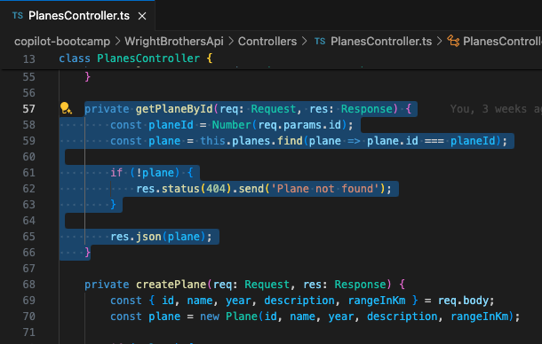
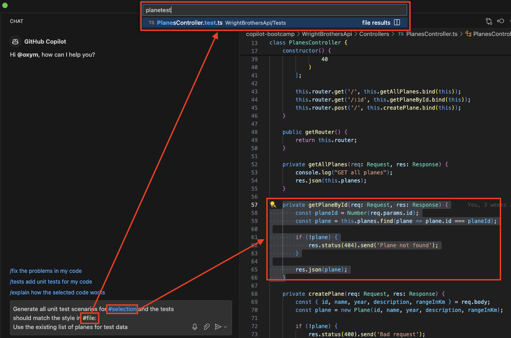
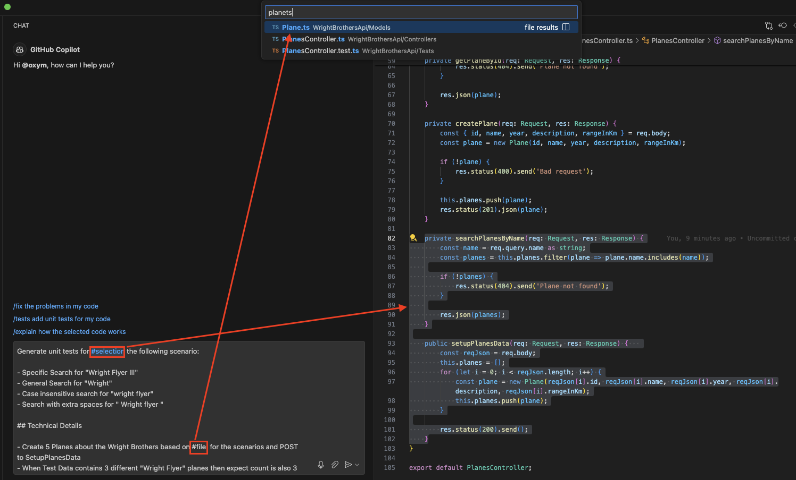
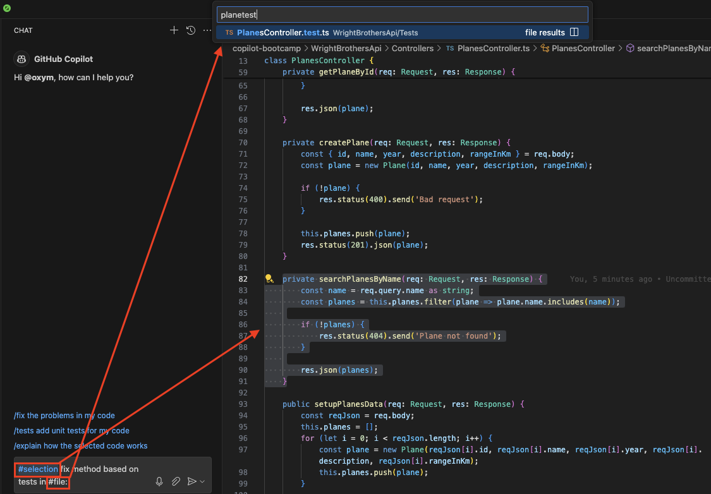
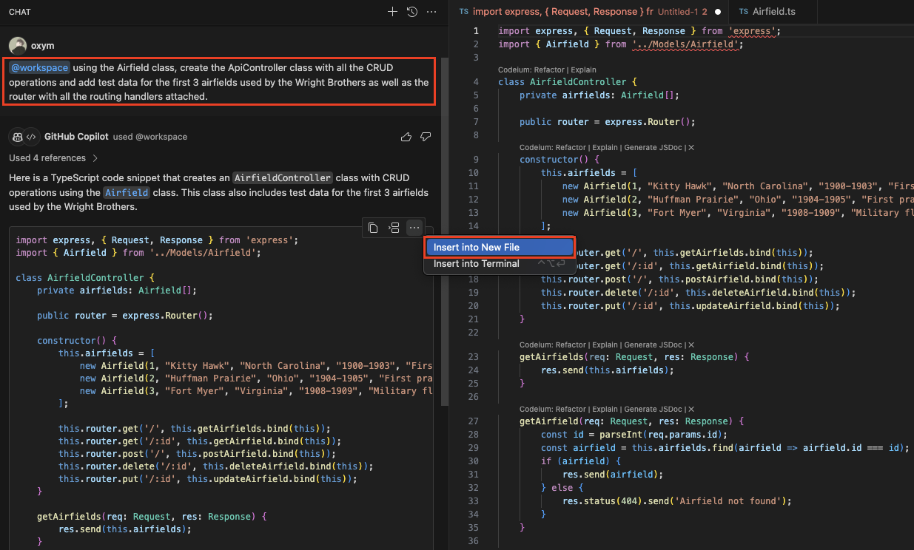

# Lab 2.2 - Taking Off with Code: Clearing the Runway

This lab exercise guides participants through coding exercises using GitHub Copilot to understand its suggestions and capabilities. It involves running and adding unit tests, with an emphasis on pair programming. The lab is structured in steps, starting with executing existing unit tests, followed by enhancing test coverage, and addressing specific functionalities like case sensitivity and trimming in search methods.

## Prerequisites
- The prerequisites steps must be completed, see [Labs Prerequisites](../Lab%201.1%20-%20Pre-Flight%20Checklist/README.md)

## Estimated time to complete

- 20 minutes, times may vary with optional labs.

## Objectives

- Simple coding exercises using GitHub Copilot, focusing on understanding its suggestions and capabilities.
- Pair programming: One 'pilot' codes, the other guides using Copilot's suggestions.

    - Step 1 - Taxying to the Runway - Run Existing Unit Tests
    - Step 2 - Pre-takeoff Pilot Checks - Improving Test Coverage
    - Step 3 - Taking off - Applying TDD using Copilot
    - Step 4 - Ascending to the Clouds: Creating the AirfieldController from Thin Air (Optional)

### Step 1: Taxying to the Runway - Run existing Unit Tests

- Open GitHub Copilot Chat, click **+** to clear prompt history.

- Type the following in the chat window:

    ```sh
    @workspace how do I run the unit tests?
    ```

- Copilot will give a suggestion to run the unit tests in the terminal.

    ```sh
    npm test
    ```

- Let's run the unit tests in the terminal to make sure everything is working as expected.

- From the Copilot Chat window, select one of the two options:

  1. Click the `Insert into Terminal` button.

  1. Click copy button, then, open a new Terminal window by pressing **Ctrl+`** (Control and backtick), paste into Terminal window.

- Open the terminal and run the tests with the provided command.

    ```sh
    npm test
    ```

> [!NOTE]
> If you get an error resembling this: `npm error enoent Could not read package.json`, then you are most likely running this command from the wrong folder. Change into the correct directory with `cd ./WrightBrothersApi` or with `cd ..` to go one folder level upwards.

- The tests should run and pass.

    ```sh
    Test Suites: 1 passed, 1 total
    Tests:       1 passed, 1 total
    Snapshots:   0 total
    Time:        0.295 s, estimated 1 s
    ```

### Step 2: Pre-takeoff Pilot Checks - Improving Test Coverage

- Open GitHub Copilot Chat, click **+** to clear prompt history.

- Type the following in the chat window:

    ```sh
    @workspace where do I add additional unit tests?
    ```

- Copilot will give a suggestion to add unit tests to the `Tests` directory of the `WrightBrothersApi` project.

- You can add additional unit tests in the `PlanesController.test.ts` file



- Open Copilot Chat and Copy/Paste the following

    ```md
    Generate all unit test scenarios for #selection
    Use the existing list of planes for test data
    ```



- For `#selection`, open the `PlaneController.ts` file.

- Select all the code for the `GetById` method.

- Press `Enter`, GitHub Copilot will automatically suggest the `describe` and `beforeEach` directives.

- The problem is that the generated test methods do not match with the style of the existing test methods in the `PlanesController.test.ts` file.

- Let's fix this. Open Copilot Chat and Copy/Paste the following and place your cursor after `tests should match `:

    ```md
    Generate all unit test scenarios for #selection and the tests should match the style in <---- Place your cursor here
    Use the existing list of planes for test data
    ```

- Delete `<---- Place your cursor here`, and type `#file` in the chat window and press Enter.



- A pop-up will appear where you can search for files.

> [!NOTE]
> With `#file` you can easily add a file to the Copilot Context.

- Select the file `PlanesController.test.ts` and press Enter.

> [!IMPORTANT]
> `#file` will not work with copy/pasting `#file:PlanesController.test.ts `. You need to select it from the pop-up window. Since the VS Code supports fuzzy search in file lookup, you can just type `planestest` and the file `PlanesController.test.ts` should become the top result.

- Now submit the prompt by pressing Enter.

- Copilot will give a suggestion to generate all unit test scenarios for the `GetById` method.

    ```typescript
    test('GET /:id - returns plane when id exists', async () => {
    const id = '1'; // assuming plane with id 1 exists
    const res = await request(app).get(`/${id}`);

    expect(res.statusCode).toEqual(200);
    expect(res.body).toHaveProperty('id');
    // add more checks for other properties if needed
    });

    test('GET /:id - returns 404 when id does not exist', async () => {
        const id = '9999'; // assuming plane with id 9999 does not exist
        const res = await request(app).get(`/${id}`);

        expect(res.statusCode).toEqual(404);
        expect(res.text).toEqual('Plane not found');
    });
    ```

> [!NOTE]
> Copilot generated two unit tests for the `GetById` method. The first test checks if the method returns a plane when the id exists. The second test checks if the method returns a `NotFound` result when the id does not exist. It also matches how the unit tests are structured in the `PlanesController.test.ts` file.

> [!NOTE]
> Creating unit tests works best when the scope is limited to a single method. You can then use `#file` to make sure it creates unit tests that is in line with the existing unit tests.

- Now Open `PlanesController.test.ts` and Place your cursor at the end of the test suite, after the `});` of the `GET / - returns list of planes` test.

    ```typescript
    describe('PlanesController', () => {
        test('GET / - returns list of planes', async () => {
            // test body
        });

        <---- Place your cursor here
    });
    ```

- In GitHub Copilot Chat, click the ellipses `...` and select `Insert at Cursor` for the suggested unit test methods.

- Let's test the newly added tests by opening the terminal and run the tests with the provided command.

    ```sh
    npm test
    ```

> [!NOTE]
> Some tests might still fail. Copilot does not always provide the correct suggestions. It's important to understand the suggestions and do some extra work to make sure the tests are correct. Copilot can help you with that as well.

- The tests should run and pass.

    ```sh
    Test Suites: 1 passed, 1 total
    Tests:       3 passed, 3 total
    Snapshots:   0 total
    Time:        0.416 s, estimated 1 s
    ```

## Optional

### Step 3: Taking Off - Applying TDD using Copilot

- Open the `PlanesController.ts` file.

- Make sure to add the `searchPlanesByName` method to the `PlanesController.ts` file if you haven't already in the previous lab. If not, use the following code snippet to add the method at bottom of the file.

    ```typescript
    private searchPlanesByName(req: Request, res: Response) {
        const name = req.query.name as string;
        const planes = this.planes.filter(plane => plane.name.includes(name));
    
        if (!planes) {
            res.status(404).send('Plane not found');
        }
    
        res.json(planes);
    }
    ```

- Also, add the following method at the bottom of file to setup data for the tests we are about to create.

    ```typescript
    public setupPlanesData(req: Request, res: Response) {   
        const reqJson = req.body;
        this.planes = [];
        for (let i = 0; i < reqJson.length; i++) {
            const plane = new Plane(reqJson[i].id, reqJson[i].name, reqJson[i].year, reqJson[i].description, reqJson[i].rangeInKm);
            this.planes.push(plane);
        }

        res.status(200).send();
    }
    ```

> [!NOTE]
> Setting up data like this is not recommended in a production environment. It's better to use a database or a mock database for this purpose. For the sake of this lab, we are using this approach.

- Lastly, add the following route handlers before the other handlers in the `PlanesController` constructor.

    ```typescript
    class PlanesController {
        constructor() {
            /* remaining constructor code */

            this.router.post('/setup', this.setupPlanesData.bind(this)); // add this line
            this.router.get('/search', this.searchPlanesByName.bind(this)); // add this line
            this.router.get('/:id', this.getPlaneById.bind(this));
            this.router.get('/', this.getAllPlanes.bind(this));
            this.router.post('/', this.createPlane.bind(this));
        }
    }
    ```

> [!NOTE]
> The order of route handlers is important. The `setupPlanesData` and `searchPlanesByName` handlers should be added before the other handlers because in Express.js the first matching route handler is executed.

- In the following exercise you will combine everything you learned in the previous steps, but then for the `searchPlanesByName` method. The following prompt is a more detailed description of a problem and the expected solution. You will prompt GitHub Copilot to make it use a `#selection`. besides that you will use `#file` two times in the prompt to make sure Copilot knows the context of the problem.

- Open GitHub Copilot Chat, click **+** to clear prompt history.

- Copy/Paste the following in the Copilot Chat window:

    ```md
    Generate unit tests for #selection the following scenario:

    - Specific Search for "Wright Flyer III"
    - General Search for "Wright"
    - Case insensitive search for "wright flyer"
    - Search with extra spaces for " Wright flyer "

    ## Technical Details

    - Create 5 Planes as a JSON array about the Wright Brothers based on #file:Plane.ts for the scenarios and create a POST request to the `/setup` endpoint for SetupPlanesData
    - Use encoded value for space characters in the search query URL
    - When Test Data contains 3 different "Wright Flyer" planes then expect count is also 3
    - Expect the amount of planes returned
    - Give me only the test methods in the result to add to the existing tests in #file:PlanesController.test.ts
    - Exclude import statements from the result
    ```



- For `#selection`, select the following two methods in the `PlanesController.ts` class.

    ```typescript
    private searchPlanesByName(req: Request, res: Response) {
        const name = (req.query.name as string).trim();
        const planes = this.planes.filter(plane => plane.name.toLowerCase().includes(name.toLowerCase()));
    
        if (!planes) {
            res.status(404).send('Plane not found');
        }
    
        res.json(planes);
    }

    public setupPlanesData(planes: IPlane[], res: Response) {        
        this.planes = planes;

        res.status(200).send();
    }
    ```

- Next Re-enter `#file:Plane.ts`

> [!NOTE]
> When copy/posting the `#file:Plane.ts`, it will not work. You will need to select the file again from the pop-up window, like in the previous step.

- First remove `#file:Plane.ts` and keep your cursor at the same position.

- Next, type `#file` again in the chat window and press Enter, like in the previous step and select the `Plane.ts` file.

- Now, do the same for `#file:PlanesController.test.ts` on the bottom of the prompt.

> [!NOTE]
> This example shows how `#file` is used in a way how a human might approach a problem. You can include context at any time to help Copilot understand the problem or solution better.

- Submit the prompt by pressing Enter.

- Copilot will then give the following suggestion to generate unit tests for the `searchPlanesByName` method.

    ```typescript
    describe('PlanesController', () => {
        const planesData = [
            { id: 1, name: 'Wright Flyer I', year: 1903, description: 'First powered flight', rangeInKm: 0.056 },
            { id: 2, name: 'Wright Flyer II', year: 1904, description: 'Improved design', rangeInKm: 3.22 },
            { id: 3, name: 'Wright Flyer III', year: 1905, description: 'First practical plane', rangeInKm: 39.1 },
            { id: 4, name: 'Wright Model A', year: 1906, description: 'First production plane', rangeInKm: 100 },
            { id: 5, name: 'Wright Model B', year: 1910, description: 'Improved Model A', rangeInKm: 160 }
        ];

        beforeAll(async () => {
            await request(app).post('/setup').send(planesData);
        });

        test('GET /search - specific search for "Wright Flyer III"', async () => {
            const res = await request(app).get('/search?name=Wright%20Flyer%20III');

            expect(res.statusCode).toEqual(200);
            expect(res.body).toHaveLength(1);
            expect(res.body[0].name).toEqual('Wright Flyer III');
        });

        test('GET /search - general search for "Wright"', async () => {
            const res = await request(app).get('/search?name=Wright');

            expect(res.statusCode).toEqual(200);
            expect(res.body).toHaveLength(5);
        });

        test('GET /search - case insensitive search for "wright flyer"', async () => {
            const res = await request(app).get('/search?name=wright%20flyer');

            expect(res.statusCode).toEqual(200);
            expect(res.body).toHaveLength(3);
        });

        test('GET /search - search with extra spaces for " Wright flyer "', async () => {
            const res = await request(app).get('/search?name= Wright%20flyer%20');

            expect(res.statusCode).toEqual(200);
            expect(res.body).toHaveLength(3);
        });
    });
    ```

- Open `PlanesController.test.ts` file

- Place your cursor at the end of the file, after the last unit test `}`.

    ```typescript
    describe('PlanesController', () => 
    {
        // method body
    });

    <---- Place your cursor here
    ```

- In GitHub Copilot Chat, click the ellipses `...` and select `Insert at Cursor` for the suggested unit test methods.

- Let's run the unit tests in the terminal:

    ```sh
    npm test
    ```

- Not all tests will pass. For example the `Case insensitive` and `Extra spaces` test will fail. This is because the `searchPlanesByName` method is case sensitive. Let's fix this.

> ![Note] It could happen that Copilot already made the method case insensitve during creation. You can then continue with the next task as still some tests cases will fail.

    ```
    Test Suites: 1 failed, 1 total
    Tests:       2 failed, 3 passed, 5 total
    Snapshots:   0 total
    Time:        0.421 s, estimated 1 s
    ```

- Let's now use the generated tests as a guide to fix the case sensitivity issue.

- Open GitHub Copilot Chat, click **+** to clear prompt history.

- Copy/Paste the following in the chat window:

    ```
    #selection fix method based on tests in #file:PlanesController.test.ts 
    ```

- Open `PlanesController.ts` file.

- For `#selection`, select the `searchPlanesByName` method in the `PlanesController.ts` file.

    ```typescript
    private searchPlanesByName(req: Request, res: Response) {
        const name = req.query.name as string;
        const planes = this.planes.filter(plane => plane.name.includes(name));
    
        if (!planes) {
            res.status(404).send('Plane not found');
        }
    
        res.json(planes);
    }
    ```

- First remove `#file:PlanesController.test.ts ` and keep your cursor at the same position.

- Next, type `#file` again in the chat window and press Enter and select the `PlanesController.test.ts ` file.



- Submit the prompt by pressing Enter.

- Copilot will give a suggestion to fix the case sensitivity and the extra spaces issue based on the test cases.

    ```typescript
    private searchPlanesByName(req: Request, res: Response) {
        const name = (req.query.name as string).trim().toLowerCase();
        const planes = this.planes.filter(plane => plane.name.toLowerCase().includes(name));

        if (!planes.length) {
            return res.status(404).send('Plane not found');
        }

        res.json(planes);
    }
    ```

> [!NOTE]
> `toLowerCase()` is used to convert both values to lower case for case insensitive comparison and `trim()` is used to remove leading and trailing spaces.

- Apply the changes to the `PlanesController.ts` file.

- Click on the `Insert at cursor` to replace the `searchPlanesByName` method with the new one.

- Open the terminal and run the tests with the provided command

    ```sh
    npm test
    ```

- The tests should run and pass.

    ```sh
    Test Suites: 1 passed, 1 total
    Tests:       5 passed, 5 total
    Snapshots:   0 total
    Time:        0.534 s, estimated 1 s
    ```

> [!NOTE]
> If all tests pass, you have successfully completed this step. If not, you will need to debug the tests. GitHub Copilot got you started, but you, the Pilot, must take charge to diagnose and fix the discrepancies.

## Optional

### Step 4 - Ascending to the Clouds: Creating the AirfieldController from Thin Air

- Open the `WrightBrothersApi` folder in Visual Studio Code.

- Open the `Models/Airfield.ts` file.

- Open GitHub Copilot Chat, click **+** to clear prompt history.

- Ask the following question:

    ```
    @workspace using the Airfield class, create a new ApiController class with all the CRUD operations and add test data for the first 3 airfields used by the Wright Brothers as well as the router with all the routing handlers attached.
    ```

- Copilot will give a suggestion to create an `AirfieldController` class based on the `Airfield` class.

    ```typescript
    import express, { Request, Response } from 'express';
    import { Airfield } from '../Models/Airfield';

    class AirfieldsController {
        private airfields: Airfield[];

        public router = express.Router();

        constructor() {
            this.airfields = [
                new Airfield(1, "Kitty Hawk", "North Carolina", "1900-3000", "First successful flight"),
                new Airfield(2, "Huffman Prairie", "Ohio", "1904-1905", "First practical airplane"),
                new Airfield(3, "Fort Myer", "Virginia", "1908-1909", "Military flight trials")
            ];

            this.router.get('/', this.getAirfields.bind(this));
            this.router.get('/:id', this.getAirfield.bind(this));
            this.router.post('/', this.postAirfield.bind(this));
            this.router.delete('/:id', this.deleteAirfield.bind(this));
            this.router.put('/:id', this.updateAirfield.bind(this));
        }

        // GET: 
        getAirfields(req: Request, res: Response) {
            res.send(this.airfields);
        }

        // GET: 3
        getAirfield(req: Request, res: Response): void {
            const id = parseInt(req.params.id);
            if (id < 0 || id >= this.airfields.length) {
                res.status(404).send("Airfield not found");
            }
            res.status(200).send(this.airfields[id]);
        }

        // POST: 
        postAirfield(req: Request, res: Response): void {
            const airfield: Airfield = req.body;
            this.airfields.push(airfield);
            res.status(201).send(airfield);
        }

        // DELETE:
        deleteAirfield(req: Request, res: Response): void {
            const id = parseInt(req.params.id);
            const index = this.airfields.findIndex(a => a.id === id);
            if (index === -1) {
                res.status(404).send("Airfield not found");
                return;
            }

            this.airfields.splice(index, 1);
            res.status(200).send("Airfield with id: " + id + " deleted");
        }

        // PUT: 2
        updateAirfield(req: Request, res: Response): void {
            const id = parseInt(req.params.id);
            const index = this.airfields.findIndex(a => a.id === id);
            if (index === -1) {
                res.status(404).send("Airfield not found");
                return;
            }
            const airfield: Airfield = req.body
            this.airfields[index] = airfield;
            res.status(200).send(airfield);
        }
    }

    export default new AirfieldsController().router;
    ```

- In GitHub Copilot Chat, click the ellipses `...` and select `Insert into New File` for the suggested `AirfieldController`.

- Copilot will add the code to a new empty file, but must be saved.
- Save the file by clicking pressing `Ctrl + S` or `Cmd + S`.
- Change directory to the `Controllers` folder`.
- Enter the file name `AirfieldController.ts` and click `Save`.



> [!NOTE]
> Copilot is not only context aware, knows you need a list of items and knows the `Air Fields` used by the Wright Brothers, the `Huffman Prairie`, which is the first one used by the Wright Brothers.

- Now let's run the unit tests in the terminal to make sure everything is working as expected.

- Open the terminal and run the tests with the provided command.

    ```sh
    npm test
    ```

- The tests should run and pass.

    ```sh
    Test Suites: 1 passed, 1 total
    Tests:       1 passed, 1 total
    Snapshots:   0 total
    Time:        0.568 s
    ```

> [!NOTE]
> Sometimes not all tests succeed. Make sure `npm test` is run in the root of the project `WrightBrothersApi`. If the tests fail, you will need to debug the tests and correct the issues. Although tools like Copilot can assist greatly, you, the Pilot, must take charge to diagnose and fix the discrepancies.

- Now everything is working as expected, it's time to take off.

- Run the application by typing the following commands in the terminal:

    ```sh
    npm run build && npm start
    ```

- Open the `Examples/Airfields.http` file, click `Send Request` to execute the `GET all airfields` request.

- You will see a list of airfields are returned and the response is `200 OK`.

- Response will be:

    ```json
    HTTP/1.1 200 OK
    
    ...

    Connection: close

    [
        {
            "id": 1,
            "name": "Kitty Hawk",
            "location": "North Carolina",
            "datesOfUse": "1900-3000",
            "significance": "First successful flight"
        },
        /* rest of the airfields */
    ]
    ```

- Stop the application by pressing `Ctrl+C` in the terminal window.

### Congratulations you've made it to the end! &#9992; &#9992; &#9992;

#### And with that, you've now concluded this module. We hope you enjoyed it! &#x1F60A;
