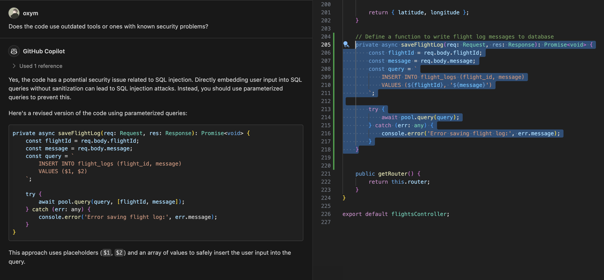

# Lab 3.1 - Safe Landing: Code Review and Analysis

This lab exercise focuses on advanced code review techniques using GitHub Copilot. Participants will learn to enhance code quality by explaining code functionality, improving readability, checking for security vulnerabilities, and optimizing performance.

## Prerequisites
- The prerequisites steps must be completed, see [Labs Prerequisites](../Lab%201.1%20-%20Pre-Flight%20Checklist/README.md)

## Estimated time to complete

- 45 minutes, times may vary with optional labs.

## Objectives

- To learn advanced topics in code review using Github Copilot:
    - Step 1 - Explain Code Functionality
    - Step 2 - Readability and Coding Standard
    - Step 3 - Check for Security Vulnerabilities
    - Step 4 - Check for Speed and Performance

### Step 1 - Explain Code Functionality

- Open GitHub Copilot Chat, then type the following:

    ```md
    @workspace what does the FlightsController do?
    ```
- Copilot will provide a brief description of the `FlightsController` class and a summary of all the methods within the controller class.

    

- Click on `updateStatus` in the list, and you will be taken to the `updateStatus` method in the `FlightsController.ts` file.

- Notice the `updateStatus` method is very complex.

- Select all content of the method `updateStatus`, then press `Ctrl/Cmd + I` to bring up the inline chat prompt.

- Type `/explain` in the chat prompt and Copilot will provide a detailed explanation of what the `updateStatus` method does.

    

- You can click the `View in Chat` button at the bottom of the chat prompt, if you want to ask further questions regarding the explanation in the side chat.

- Otherwise, simply click the `Close` button or a blank spot outside the chat prompt to close the inline chat prompt.

### Step 2 - Readability and Coding Standard

- Open the `Controllers/FlightsController.ts`.

- Inspect the `parse` method and notice the method itself and the variable `arr` could be named more descriptively.

- Select all content of the method `parse`.

- Open GitHub Copilot Chat, click **+** to clear prompt history, then type the following:

    ```md
    Do all the names convey what a function does or what a variable is?
    ```

- Copilot will suggest renaming the method and the variable and the following code:

    ```typescript
    private parseCoordinate(coordinate: string): { latitude: number, longitude: number } {
        const coordinates = coordinate.split(',');

        // Parse latitude
        let match = coordinates[0].match(/^([0-9.]+)([NS])$/);
        if (!match) {
            throw new Error('Invalid latitude format');
        }
        let latitude = parseFloat(match[1]);
        if (match[2] === 'S') {
            latitude = -latitude;
        }

        // Parse longitude
        match = coordinates[1].match(/^([0-9.]+)([EW])$/);
        if (!match) {
            throw new Error('Invalid longitude format');
        }
        let longitude = parseFloat(match[1]);
        if (match[2] === 'W') {
            longitude = -longitude;
        }

        return { latitude, longitude };
    }
    ```

- Open the `eslint.config.mjs` file.

- Notice some of the coding standards defined in the file, such as `const` is preffered over `let` where possible.

    ```javascript
    rules: {
        // Other rules

        // Prefer const over let where possible
        'prefer-const': 'error',
    }
    ```

> [!NOTE]
> The `eslint.config.mjs` file is a modern configuration file for ESLint, using the ES Module syntax (.mjs for Module JavaScript). It allows you to define your ESLint settings, including rules, parser options, and plugins, using the latest JavaScript features. This file is especially useful for projects using ES modules, enabling very dynamic and modular configuration.

- Reopen the `Controllers/FlightsController.ts` file.

- Notice the `let` is used in the `parseCoordinate` method.

- Select all content of the method `parseCoordinate`.

- Open GitHub Copilot Chat, then type the following:

    ```md
    Does my code comply with coding standard in #file:eslint.config.mjs?
    ```

- Copilot will suggest changing the `let` to `const` in the `parseCoordinate` method and code similar to the following:

    ```typescript
    private parseCoordinate(coordinate: string): { latitude: number, longitude: number } {
        const coordinates = coordinate.split(',');

        // Parse latitude
        const matchLatitude = coordinates[0].match(/^([0-9.]+)([NS])$/);
        if (!matchLatitude) {
            throw new Error('Invalid latitude format');
        }
        let latitude = parseFloat(matchLatitude[1]);
        if (matchLatitude[2] === 'S') {
            latitude = -latitude;
        }

        // Parse longitude
        const matchLongitude = coordinates[1].match(/^([0-9.]+)([EW])$/);
        if (!matchLongitude) {
            throw new Error('Invalid longitude format');
        }
        let longitude = parseFloat(matchLongitude[1]);
        if (matchLongitude[2] === 'W') {
            longitude = -longitude;
        }

        return { latitude, longitude };
    }
    ```

- Click on the `Insert at Cursor` button to replace the selected code.

> [!NOTE]
> The `Insert at Cursor` function sometimes will paste the code with incorrect indentation, so you might need to manually fix some minor indentation issues.

### Step 3 - Check for Security Vulnerabilities

- Open the `Controllers/FlightsController.ts`.

- Inspect the `saveFlightLog` method and notice the code directly embeds `flightId` and `message` from user input into the SQL query, which could lead to SQL injection.

- Select all content of the method `saveFlightLog`.

- Open GitHub Copilot Chat, then type the following:

    ```md
    Does my code have any security vulnerabilities?
    ```

- Copilot will suggest using parameterized queries to prevent SQL injection and code similar to the following:

    ```typescript
    private async saveFlightLog(req: Request, res: Response): Promise<void> {
        const flightId = req.body.flightId;
        const message = req.body.message;
        const query = `
            INSERT INTO flight_logs (flight_id, message)
            VALUES ($1, $2)
        `;

        try {
            await pool.query(query, [flightId, message]);
        } catch (err: any) {
            console.error('Error saving flight log:', err.message);
        }
    }
    ```

    

- Click on the `Insert at Cursor` button to replace the selected code.

> [!NOTE]
> The `Insert at Cursor` function sometimes will paste the code with incorrect indentation, so you might need to manually fix some minor indentation issues.

- Open the `OwaspTop10.json` file.

- Notice the most common and severe web application security vulnerabilities compiled by the Open Worldwide Application Security Project (OWASP), which represents a broad consensus about the most critical security risks to web applications.

- Open GitHub Copilot Chat, then type the following:

    ```md
    Check the security vulnerabilities in #file:FlightsController.ts using checklist #file:OwaspTop10.json
    ```

- Copilot will generate a detailed report broken down by vulnerability type. For each vulnerability, Copilot will give what the issue is and suggest a fix. It will give an actionable summary at the end with all the vulnerabilities found and the suggested fixes, similar to the following:

    ```md
    Summary of Vulnerabilities and Fixes
    1. Broken Access Control: Implement authentication and authorization.
    2. Injection: Use parameterized queries.
    3. Insecure Design: Validate inputs, handle errors securely.
    4. Security Misconfiguration: Securely configure the application and dependencies.
    5. Vulnerable and Outdated Components: Regularly update dependencies.
    6. Identification and Authentication Failures: Implement authentication.
    7. Software and Data Integrity Failures: Implement integrity checks.
    8. Security Logging and Monitoring Failures: Implement logging and monitoring.
    ```
- Let's try fixing the `Broken Access Control` vulnerability.

- Open GitHub Copilot Chat, then type the following:

    ```md
    Fix the security issue in #file:FlightsController.ts; Broken Access Control: Implement authentication and authorization.
    ```

- Copilot will suggest a step-by-step plan, similar to the following:

    ```md
    1. Add Authentication Middleware: Create middleware to verify the user's identity using a token (e.g., JWT).
    2. Add Authorization Middleware: Create middleware to check if the user has the required permissions.
    3. Apply Middleware to Routes: Use the middleware in the routes that require authentication and authorization.
    ```
- For each step, Copilot will also suggest code snippets and explanations to help you implement the fix. You can use these suggestions to directly fix the vulnerability yourself or provide them as feedback to your colleague as a peer reviewer.

> [!NOTE]
> The above practice works great if you are only working on a few files or reviewing a pull request from a peer. However, if you need to scan security vulnerabilities in an entire repository or across multiple repositories, you can use static application security testing (SAST) tools, such as GitHub Advanced Security (GHAS), to automate security scanning for your codebase.

### Step 4 - Check for Speed and Performance